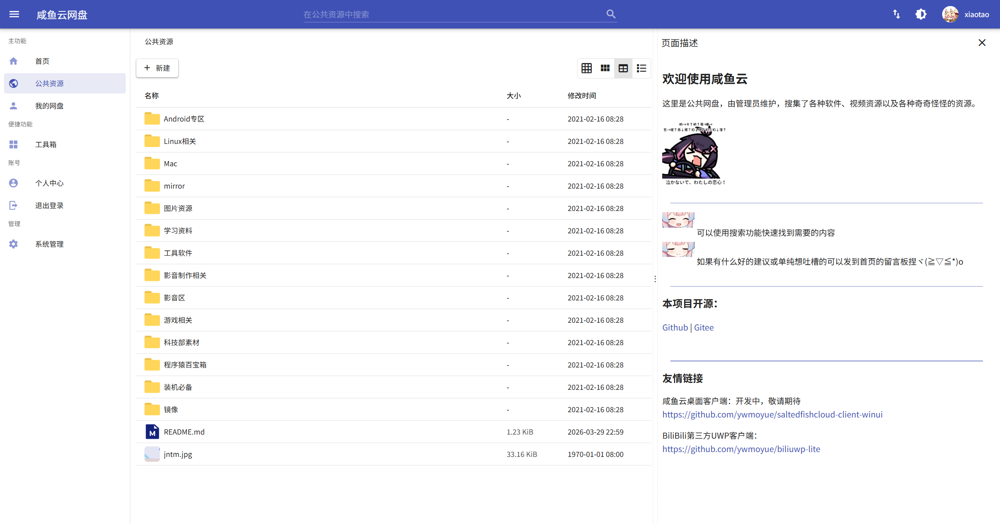
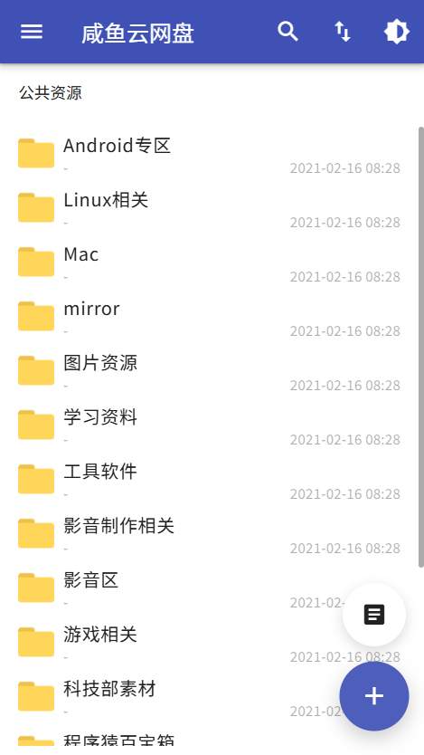
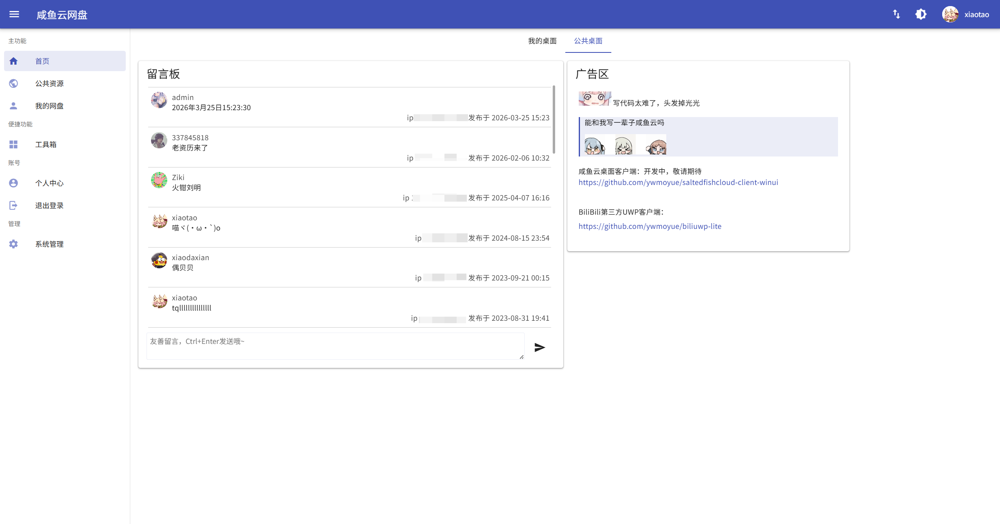
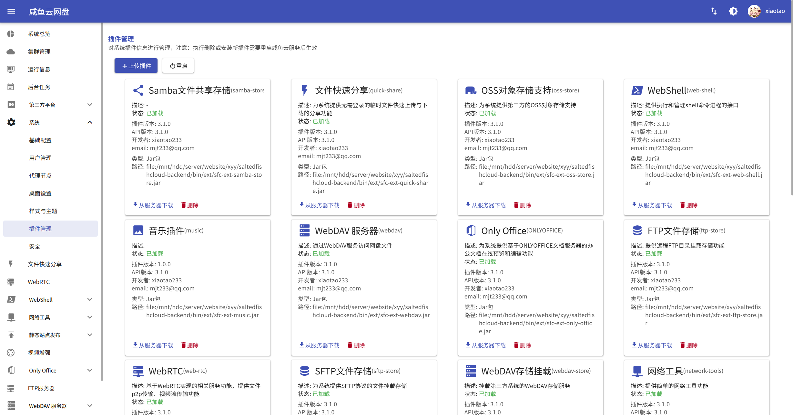
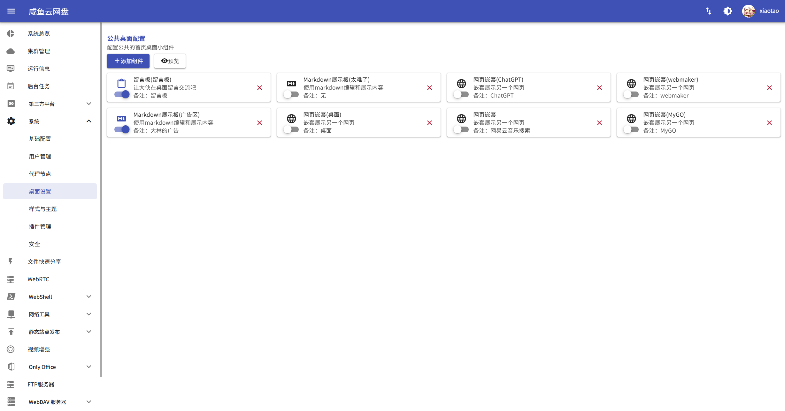

# 咸鱼云网盘 - 后端


咸鱼云网盘是一个基于 Spring Boot 的网盘后端系统，支持公共资源与私人存储双域管理，提供文件管理、分享协作、在线预览、外部存储挂载与插件化扩展能力，并提供MCP服务支持。

<div style="text-align: center;">

[在线文档](https://mjt233.github.io/saltedfishcloud-backend/) ｜ [前端(Gitee)](https://gitee.com/xiaotao233/saltedfishcloud-frontend) ｜ [前端(Github)](https://github.com/mjt233/saltedfishcloud-frontend)

</div>


## 核心能力

### 文件与网盘能力

- 公共网盘与私人网盘双域管理
- 文件搜索、文件收集、文件/目录分享
- 在线解压缩（支持密码）与压缩包内容预览
- 文本/Markdown 在线编辑与预览（支持粘贴图片）
- 视频播放、转码基础能力
- 默认基于文件哈希组织，支持秒传场景
- 支持 MCP 服务，让AI Agent获得操作网盘的能力（实验功能）

### 存储与扩展能力

- 插件化架构，支持按需装载扩展功能
- 支持外部存储挂载（S3/OSS、MinIO、SFTP、FTP、Samba、WebDAV、HDFS）
- 支持通过 FTP / WebDAV / HTTP文件列表页面 对外提供文件访问服务
- 支持目录静态发布、OnlyOffice 集成、WebShell、网络工具、WebRTC(实验功能) 等扩展能力

### 账号与认证能力

- 支持 OAuth 开放平台能力，可为第三方应用提供授权接入
- 支持通过第三方平台登录，当前支持 `Github` 与 `Google`

### 工程与运维能力

- 基于 Spring Boot + JPA + Redis + MySQL
- 兼容版本升级与数据库自动迁移
- 统一配置体系，支持后台动态管理大量配置项
- 支持 Maven 构建与 Docker 部署

## 界面展示

| 目录浏览与`README.md`自动预览                   | 移动端兼容                              |
|----------------------------------------|------------------------------------|
|  |  |

| 首页(可自定义)                       |
|--------------------------------|
|  |

| 管理后台                                               |
|----------------------------------------------------|
|                  |
|  |

## 快速开始

### 1) 环境要求

- JDK 25
- Maven 3.8+
- MySQL(默认，可选SQLite)
- Redis(默认，可选单机内存缓存)

通过调整配置，可实现仅依靠Java就能将网盘运行起来，配置方法请参考文档 [参数配置](./docs/quick-start/config.md)

### 2) 构建打包

```bash
mvn package
```

产物默认输出到 `release/`：

- 主程序: `release/sfc-core.jar`
- 可用插件: `release/ext-available/*.jar`

### 3) 启动服务

先根据实际环境修改配置文件（可参考 `conf/config.yml`），重点确认 MySQL 和 Redis 连接信息。

```bash
java -jar release/sfc-core.jar --spring.config.import=file:conf/config.yml
```

系统默认由 JPA 自动创建/更新表结构。

### 4) Docker 部署（可选）

仓库已提供 `Dockerfile` 与 `docker-compose.yml`，可按需调整配置后使用：

```bash
docker compose up -d --build
```


> 构建期间默认从maven官方中央仓库拉取依赖，如果想通过更换镜像地址加速构建，请参考 [Docker Compose 部署](docs/quick-start/docker/docker-compose.md)
> 或 [Dockerfile 构建](docs/quick-start/docker/dockerfile.md)

## 插件生态

插件编译后会输出到 `release/ext-available/`，将需要启用的插件复制到运行目录的 `ext/` 即可加载。

当前仓库内主要插件包括：

| 插件                       | 说明                           |
|--------------------------|------------------------------|
| `sfc-ext-apk-parser`     | APK 图标缩略图提取                  |
| `sfc-ext-ftp-server`     | FTP 服务端访问网盘                  |
| `sfc-ext-webdav`         | WebDAV 服务端访问网盘               |
| `sfc-ext-oss-store`      | S3/OSS 协议对象存储支持              |
| `sfc-ext-minio-store`    | MinIO 存储支持（逐步并入 OSS 方案）      |
| `sfc-ext-sftp-store`     | SFTP 存储挂载                    |
| `sfc-ext-ftp-store`      | FTP 存储挂载                     |
| `sfc-ext-local-mq`       | 提供基于本地内存的消息队列实现              |
| `sfc-ext-mcp`            | 提供 MCP 服务，让AI Agent获得操作网盘的能力 |
| `sfc-ext-samba-store`    | Samba 存储挂载                   |
| `sfc-ext-webdav-store`   | 外部 WebDAV 存储挂载               |
| `sfc-ext-video-enhance`  | 视频转码、封面与字幕能力增强               |
| `sfc-ext-only-office`    | OnlyOffice 在线文档与协作能力         |
| `sfc-ext-static-publish` | 目录静态站点发布                     |
| `sfc-ext-web-shell`      | 管理后台 WebShell                |
| `sfc-ext-network-tools`  | 网络工具与 WOL 支持                 |
| `sfc-ext-quick-share`    | 文件极速分享能力                     |
| `sfc-ext-webrtc`         | WebRTC 相关扩展                  |
| `sfc-ext-music`          | 音频能力扩展                       |

> 说明：外部存储相关插件仍在持续迭代中，建议在生产环境充分测试后启用。

## 文档与接口

- 用户与部署文档: `docs/quick-start/`
- 插件文档: `docs/extension/`
- 开发手册: `docs/develop/`
- OAuth 开放平台文档（第三方应用授权）: `docs/oauth/`
- Postman 接口集合: `咸鱼云PostmanAPI文档.json`

如需接入第三方登录（`Github` / `Google`），可结合后台配置与 OAuth 文档进行配置和联调。

## 参与贡献

欢迎通过 Issue / Pull Request 参与改进。

- 提交前建议先执行基础构建与必要验证
- 新功能建议补充文档与配置说明
- 涉及插件开发可参考 `docs/develop/plugin/`

## v3.2 版本迭代计划

### 代码与架构重构

- [X] 收敛`redisTemplate`使用，统一封装缓存接口，降低对`redis`的直接依赖
- [X] 运行环境不依赖外部`redis` 和 `mysql`，直接单程序运行（内置轻量级数据库和缓存方案）
- [ ] 消息队列可选配置 `redis stream` / `rabbitmq` / `kafka` 等方案
- [ ] 文件系统接口重构，优化性能，文件列表支持不依赖数据库提高IO吞吐量
- [ ] 高级文件搜索，自定义搜索范围，不依赖文件记录服务

### 功能迭代

- [X] 实现 MCP 服务插件，提供面向 AI 客户端的网盘能力接入
- [ ] 实现回收站功能
- [ ] 用户网盘空间配额控制
- [ ] 接口速率限制

## 技术鸣谢

- [Apache Tika Server](https://tika.apache.org/) — 文件类型检测与元数据提取