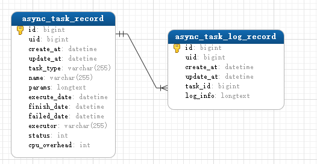
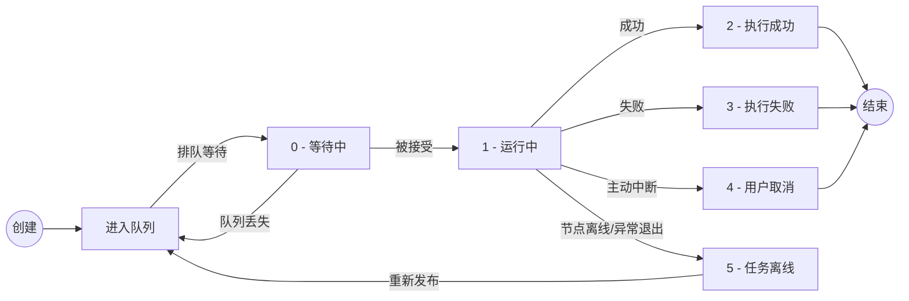

# 异步任务

## 1. 简述

异步任务可以让一些耗时较长的任务（如：视频编码转换，文件下载）放到后台运行而不阻塞请求，并提供了统一的任务控制接口。

在咸鱼云网盘异步任务框架下，支持故障转移和进度监控特性。

## 2. 相关数据表

- 异步任务记录: `async_task_record`
- 异步任务日志记录: `async_task_log_record`

模型如下：  



## 2. 角色与任务生命周期

### 2.1 角色

在咸鱼云异步任务框架下，逻辑上存在以下三个角色，每个咸鱼云网盘节点都身兼这三个角色: 

- 任务管理者 - `com.sfc.task.AsyncTaskManager`  
    负责任务的下发、任务数据管理、日志管理、执行中断控制
- 任务接收者 - `com.sfc.task.AsyncTaskReceiver`  
    负责任务的接收，并提交到执行器
- 任务执行者 - `com.sfc.task.AsyncTaskExecutor`  
    负责任务的具体执行，并可以在系统高负载下选择暂时不接受任务。


### 2.2 任务生命周期

对应数据表字段: `async_task_record.status`

- `0` - 排队中，任务提交发布后的初始状态
- `1` - 执行中，被接收器接收并提交到执行器执行
- `2` - 执行完成，由1转变
- `3` - 任务失败，由1转变
- `4` - 用户主动中断任务，由1转变
- `5` - 任务离线，即负责执行的节点宕机或掉线了，由1转变，用作故障转移标记

### 2.3 故障转移机制

当任务处于离线状态 或 排队中但任务队列不存在该任务时，会被自动重新提交执行，提交时状态变为0 - 排队中

### 2.4 流程图



## 3. 自定义异步任务

### 3.1 创建任务执行类

新建一个类，然后实现接口`com.sfc.task.AsyncTask`，样例代码:
```java
package com.sfc.task.demo;

import com.sfc.task.AsyncTask;
import com.xiaotao.saltedfishcloud.common.prog.ProgressRecord;
import com.xiaotao.saltedfishcloud.helper.CustomLogger;

import java.io.OutputStream;

public class MyTask implements AsyncTask {
    private CustomLogger logger;
    private final String originParams;
    private Thread workThread;
    private boolean running;
    private ProgressRecord progressRecord = new ProgressRecord();
    public MyTask(String originParams) { this.originParams = originParams; }

    @Override
    public void execute(OutputStream logOutputStream) {
        running = true;
        try {
            // 标记任务总量与完成量，进度与执行速度系统会自动更新
            progressRecord.setTotal(1).setLoaded(0);
            
            // 封装日志流
            logger = new CustomLogger(logOutputStream);
            
            // 解析具体的参数，注意: 参数必须确保能通过字符串反序列化得到，复杂参数对象推荐使用json
            int time = Integer.parseInt(originParams);
            
            // 任务执行
            logger.info("开始睡觉 " + time + "ms");
            workThread = Thread.currentThread();
            Thread.sleep(time);
        } catch (Exception e) {
            throw new RuntimeException(e);
        } finally {
            logger.info("睡醒了");
            running = false;
            progressRecord.setLoaded(1);
        }
    }

    @Override
    public void interrupt() {
        // 中断方法非常重要，必须尽最大努力确保任务能被得到正确终止
        // 对于一些依赖了外部的异步任务的情况，应当自行实现在执行方法中确保任务不会被重复提交或继续执行任务。
        if (running) {
            logger.warn("任务被中断");
            workThread.interrupt();
        }
    }

    @Override
    public boolean isRunning() { return running; }

    @Override
    public String getParams() { return originParams; }

    @Override
    public ProgressRecord getProgress() {
        // 应当返回对象引用以便让外部更新进度和速度
        return progressRecord;
    }
}

```

### 3.2 创建任务工厂

实现接口`com.sfc.task.AsyncTaskFactory`

任务实例可能需要依赖一些Spring容器中的Bean，在这里可以对任务对象实例手动完成依赖装配

```java
package com.sfc.task.demo;

import com.sfc.task.AsyncTask;
import com.sfc.task.AsyncTaskFactory;
import com.sfc.task.model.AsyncTaskRecord;

public class MyTaskFactory implements AsyncTaskFactory {
    @Override
    public AsyncTask createTask(String params, AsyncTaskRecord asyncTaskRecord) {
        return new MyTask(params);
    }

    @Override
    public String getTaskType() {
        // !!! 非常重要 !!! 这个是一类异步任务的唯一身份标识
        return "my-task";
    }
}
```

### 3.3 注册工厂

为了确保异步任务系统从队列中接收到任务信息后，能够正确创建任务实例，需要将对应的任务工厂注册到任务管理器。

若任务管理器找不到任务工厂，会将任务退回到队列。

注册方式有三种：

1. 使用基于的注解自动注入到Bean容器，需要在包扫描路径下

    ```java
    import org.springframework.stereotype.Component;
    
    @Component
    public class YourFactory implements AsyncTaskFactory {
        // 略 xxxx
    }
    ```

2. Spring配置类注入到Bean容器

    ```java
    
    import org.springframework.context.annotation.Bean;
    import org.springframework.context.annotation.Configuration;
    
    @Configuration
    public class YourConfiguration {
        // 略 xxxx
        @Bean
        public YourFactory yourFactory() {
            return yourFactoryInstance;
        }
    }
    ```

3. 手动注册

    从Spring容器中获取`com.sfc.task.AsyncTaskManager`，调用`registerFactory`方法即可，实例代码:
    
    ```java
    import org.springframework.beans.factory.annotation.Autowired;
    import org.springframework.stereotype.Component;
    
    @Component
    public class Demo {
        @Autowired
        private AsyncTaskManager asyncTaskManager;
    
        public void yourMethod() {
            asyncTaskManager.registerFactory(yourFactoryInstance);
        }
    }
    ```

## 4. 任务管理

任务管理的所有方法均支持集群模式下数据一致性

### 4.1 提交任务

需要构造`AsyncTaskRecord`对象后，通过`com.sfc.task.AsyncTaskManager`进行提交。

代码示例:

```java
import com.sfc.task.AsyncTaskManager;
import com.sfc.task.model.AsyncTaskRecord;

public class SleepService {
    @Autowired
    private AsyncTaskManager asyncTaskManager;
    
    public void submitTask(Long time) {

        // 创建任务
        AsyncTaskRecord asyncTaskRecord = AsyncTaskRecord.builder()
                // 任务名称，可随意设置
                .name("睡觉任务: 睡" + time + "毫秒")
                // 任务类型，需要与任务工厂的getTaskType对应
                .taskType(AsyncTaskType.OFFLINE_DOWNLOAD)
                // 设定参数，复杂对象可用json
                .params(time + "")
                // 预设CPU开销，1个CPU核心为100算。
                .cpuOverhead(20)
                .build();

        // asyncTaskRecord.setId(IdUtil.getId());
        // 可选择手动指定id，也可任务提交后，使用asyncTaskRecord自动生成的id字段
        // 如果你的离线下载有单独的数据表，则可使用这个id字段进行关联

        // 提交任务
        asyncTaskManager.submitAsyncTask(asyncTaskRecord);
        
    }
}

```

### 4.2 任务中断

`asyncTaskManager.interrupt(taskId);`

### 4.3 日志获取

`asyncTaskManager.getTaskLog(taskId, true);`

该方法返回一个`Resource`对象，通过`getInputStream()`来获取日志数据的输入流。


> **TIPS**  
> 目前该方法只能固定获取所有历史日志及运行中任务的当前产生的日志，也就是说现在第二个参数是没啥用的。

### 4.4 获取任务执行进度

`asyncTaskManager.getProgress(taskId);`

获取的进度对象中，存在经过系统自动计算的每1秒钟的执行速度。

> **TIPS**  
> 该方法取得的进度对象和任务实例的getProgress()返回值不是同一引用，是反序列化后构造的对象。