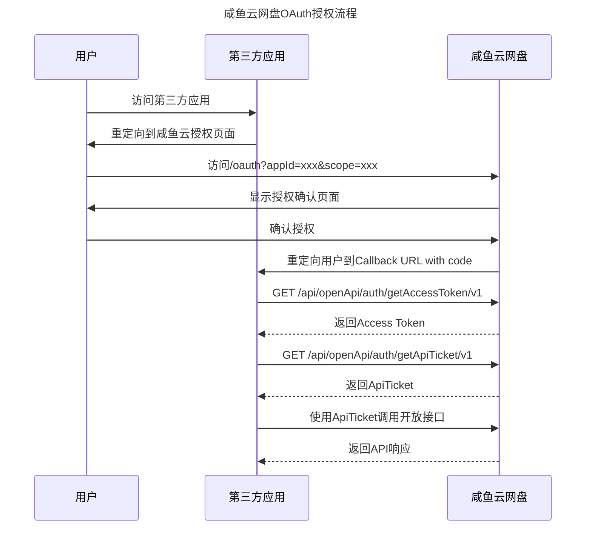

# OAuth开放平台

咸鱼云网盘提供OAuth 2.0开放平台授权机制，允许第三方应用通过咸鱼云网盘进行用户身份验证和授权访问。

## 概述

咸鱼云网盘开放平台采用OAuth 2.0授权码模式，支持第三方应用获取用户授权后访问咸鱼云网盘的API接口。整个授权流程分为以下几个步骤：

1. 用户授权：第三方应用引导用户跳转到咸鱼云网盘授权页面
2. 获取授权码：用户确认授权后，咸鱼云网盘返回授权码
3. 获取Access Token：第三方应用使用授权码换取Access Token
4. 获取ApiTicket：使用Access Token获取临时或永久有效的API访问凭证
5. 调用API：使用ApiTicket访问咸鱼云网盘开放接口

## 授权范围

咸鱼云网盘开放平台支持以下授权范围：

| 范围 | 说明 | 权限说明 |
|------|------|----------|
| `profile` | 个人信息 | 获取用户基本信息，如用户名、邮箱等 |
| `storage_read` | 存储读取权限 | 读取用户的私人网盘文件和数据 |
| `storage_write` | 存储写入权限 | 修改用户的私人网盘文件和数据 |

**注意**：

- 多个授权范围使用空格分隔，例如：`profile storage_read`

## 快速开始

### 1. 创建第三方应用

在开始集成之前，您需要在咸鱼云网盘管理员后台创建您的第三方OAuth应用，并获取以下信息：

- **App ID**: 应用唯一标识
- **Client Secret**: 应用密钥，用于授权接口安全验证

### 2. 实现授权流程

以下是完整的授权流程示意图：




### 3. 详细步骤说明

#### 步骤1：引导用户授权

第三方应用需要引导用户访问咸鱼云网盘的授权页面，URL格式如下：

```
https://your-saltedfishcloud-domain/oauth?appId={appId}&scope={scope}
```

**参数说明**：

- `appId`: 第三方应用的唯一标识（必填）
- `scope`: 授权范围，多个范围用空格分隔（必填）

**示例**：
```
https://cloud.example.com/oauth?appId=123&scope=profile storage_read
```

#### 步骤2：处理授权回调

用户在授权确认页面点击“确认授权”后，咸鱼云网盘会调用授权确认接口完成授权，并根据参数决定是直接302跳转，还是返回包含授权码的JSON数据。

授权确认接口：

```bash
GET /api/oauth/authorize?appId={appId}&scope={scope}&redirect={redirect}&redirectUrl={redirectUrl}
```

**参数说明**：

- `appId`: 第三方应用的唯一标识（必填）
- `scope`: 授权范围，多个范围用空格分隔（必填）
- `redirect`: 是否直接返回302跳转响应（可选，默认 `true`）
- `redirectUrl`: 自定义重定向地址（可选）

**回调地址规则**：

- 当第三方应用已配置回调URL时：
  - 未传 `redirectUrl`：使用应用已配置的回调URL
  - 传入 `redirectUrl` 且与已配置回调URL一致：允许请求
  - 传入 `redirectUrl` 且与已配置回调URL不一致：拒绝请求
- 当第三方应用未配置回调URL时：
  - 必须传入 `redirectUrl`
  - 最终将以 `redirectUrl` 作为回调地址

当 `redirect=true` 时，最终会重定向到以下地址，并在URL中追加授权码参数：

```
https://your-callback-domain/callback?code={authorization_code}
```

**参数说明**：

- `code`: 授权码，用于换取Access Token（有效期15分钟）

当 `redirect=false` 时，接口会直接返回JSON数据，例如：

```json
{
    "code": 200,
    "businessCode": 200,
    "data": {
        "code": "77afb8216bf847368c7e7aaf7b1224eb",
        "redirectUrl": "https://your-callback-domain/callback?code=77afb8216bf847368c7e7aaf7b1224eb"
    },
    "msg": "OK"
}
```

**接口详情**：参见[授权确认接口文档](api/auth/authorize.md)

#### 步骤3：获取Access Token

使用授权码和Client Secret请求获取Access Token：

```bash
GET /api/openApi/auth/getAccessToken/v1?code={code}&clientSecret={clientSecret}
```

**接口详情**：参见[获取Access Token接口文档](api/auth/get-access-token.md)

#### 步骤4：获取ApiTicket

使用 Access Token 获取 ApiTicket：

```bash
GET /api/openApi/auth/getApiTicket/v1?accessToken={accessToken}&permanent={permanent}
```

**参数说明**：

- `accessToken`: 第 3 步获取的 Access Token，内部已包含应用与用户授权上下文
- `permanent`: 是否申请永久有效的ApiTicket（可选，默认 `false`）

**行为说明**：

- 当 `permanent=false` 时，签发15分钟有效的临时ApiTicket
- 当 `permanent=true` 时，仅允许已开启“允许永久ApiTicket”能力的第三方应用申请永久ApiTicket
- 再次获取同类型（临时/永久）ApiTicket 时，旧的同类型ApiTicket会立即失效
- 用户撤销授权后，该应用下该用户的所有ApiTicket（包含永久ApiTicket）都会立即失效

**接口详情**：参见[获取ApiTicket接口文档](api/auth/get-api-ticket.md)


#### 步骤5：调用开放接口

在调用咸鱼云网盘开放接口时，需要在请求头中添加ApiTicket：

```
Authorization: ApiTicket {api_ticket}
```

## 安全注意事项

1. **Client Secret保护**：Client Secret是应用的核心机密，必须妥善保管，不应在客户端代码中暴露
2. **HTTPS要求**：所有通信必须使用HTTPS协议，确保数据传输安全
3. **授权码有效期**：授权码有效期为15分钟，获取后应立即使用
4. **ApiTicket有效期**：默认签发15分钟有效的临时ApiTicket；若应用已开启永久ApiTicket能力，也可以申请永久ApiTicket
5. **权限最小化**：只请求应用实际需要的权限范围
6. **错误处理**：妥善处理各种错误情况，如授权被拒绝、token过期等

## 常见问题

### Q: 如何获取App ID和Client Secret？
A: 需要管理员在咸鱼云网盘管理员后台创建第三方OAuth应用，并创建应用的密钥

### Q: Access Token会过期吗？
A: Access Token有效期为90天，如果用户主动撤销授权或重新走了授权流程则会让Access Token提前失效。

### Q: 可以同时获取多个授权范围吗？
A: 可以，在scope参数中使用空格分隔多个范围，如：`profile storage_read storage_write`。

### Q: 如何撤销授权？
A: 用户可以在咸鱼云网盘的个人中心 - 第三方应用授权 中撤销授权

### Q: 永久ApiTicket会一直有效吗？
A: 永久ApiTicket不会因JWT时间过期而失效，但再次获取同类型永久ApiTicket或用户主动撤销授权后，它会立即失效。

## 下一步

- [授权确认接口文档](api/auth/authorize.md)
- [获取Access Token接口文档](api/auth/get-access-token.md)
- [获取ApiTicket接口文档](api/auth/get-api-ticket.md)
- [开放接口列表](api/index.md)