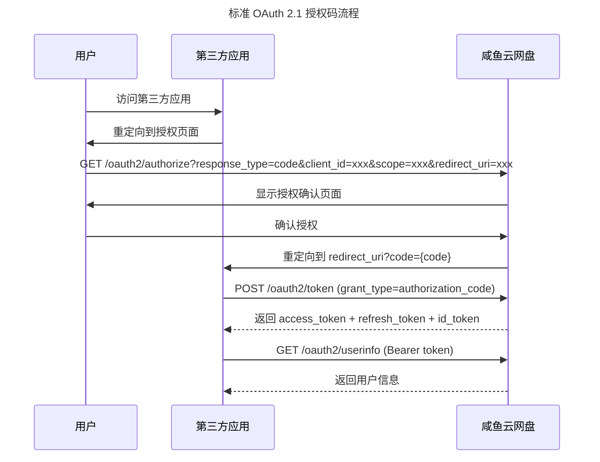
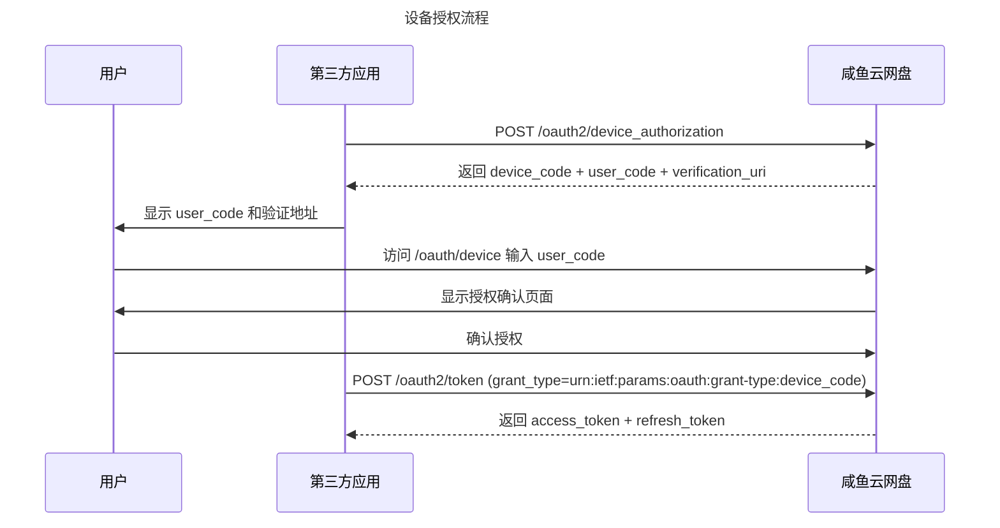

# OAuth开放平台

咸鱼云网盘提供基于 Spring Authorization Server 的标准 OAuth 2.1 / OIDC 开放平台，支持标准客户端直接接入。

## 概述

### 标准 OAuth 2.1 / OIDC 端点

标准客户端可以使用以下端点：

| 端点 | 说明 |
|------|------|
| `/.well-known/openid-configuration` | OIDC Discovery 元数据 |
| `/oauth2/authorize` | 标准授权端点 |
| `/oauth2/device_authorization` | 设备授权端点 |
| `/oauth2/token` | 标准令牌端点 |
| `/oauth2/userinfo` | 标准 UserInfo 端点 |
| `/oauth2/revoke` | 标准令牌撤销端点 |
| `/oauth2/introspect` | 标准令牌自省端点 |
| `/oauth2/jwks` | `id_token` 验签公钥 |

详细说明参见：[OIDC Provider 支持](oidc.md)

## 授权范围

咸鱼云网盘开放平台支持以下授权范围：

| 范围 | 说明 | 权限说明 |
|------|------|----------|
| `openid` | OpenID Connect | 获取用户唯一标识 |
| `profile` | 个人信息 | 获取用户基本信息，如用户名、头像等 |
| `email` | 邮箱 | 获取用户邮箱信息 |
| `storage_read` | 存储读取权限 | 读取用户的私人网盘文件和数据 |
| `storage_write` | 存储写入权限 | 修改用户的私人网盘文件和数据 |

**注意**：

- 多个授权范围使用空格分隔，例如：`profile storage_read`

## 快速开始

### 1. 创建第三方应用

在开始集成之前，您需要在咸鱼云网盘管理员后台创建您的第三方OAuth应用，并获取以下信息：

- **Client ID**: 应用唯一标识
- **Client Secret**: 应用密钥，用于授权接口安全验证

### 2. 实现授权流程

#### 授权码模式（Confidential Client）



#### 设备授权模式（Public Client）



### 3. 调用开放接口

使用 access_token 调用咸鱼云网盘开放接口：

```
Authorization: Bearer {access_token}
```

## 安全注意事项

1. **Client Secret保护**：Client Secret是应用的核心机密，必须妥善保管，不应在客户端代码中暴露
2. **HTTPS要求**：所有通信必须使用HTTPS协议，确保数据传输安全
3. **授权码有效期**：授权码有效期较短，获取后应立即使用
4. **Token有效期**：access_token 为短期令牌，refresh_token 为长期令牌
5. **权限最小化**：只请求应用实际需要的权限范围
6. **错误处理**：妥善处理各种错误情况，如授权被拒绝、token过期等

## 常见问题

### Q: 如何获取 Client ID 和 Client Secret？
A: 需要管理员在咸鱼云网盘管理员后台创建第三方OAuth应用，并创建应用的密钥

### Q: Access Token 会过期吗？
A: Access Token 为短期令牌，过期后可以使用 refresh_token 获取新的 access_token。

### Q: 可以同时获取多个授权范围吗？
A: 可以，在scope参数中使用空格分隔多个范围，如：`profile storage_read storage_write`。

### Q: 如何撤销授权？
A: 可以调用 `/oauth2/revoke` 端点撤销令牌，或在咸鱼云网盘的个人中心撤销授权。

## 下一步

- [OIDC Provider 支持](oidc.md)
- [开放接口列表](api/index.md)
